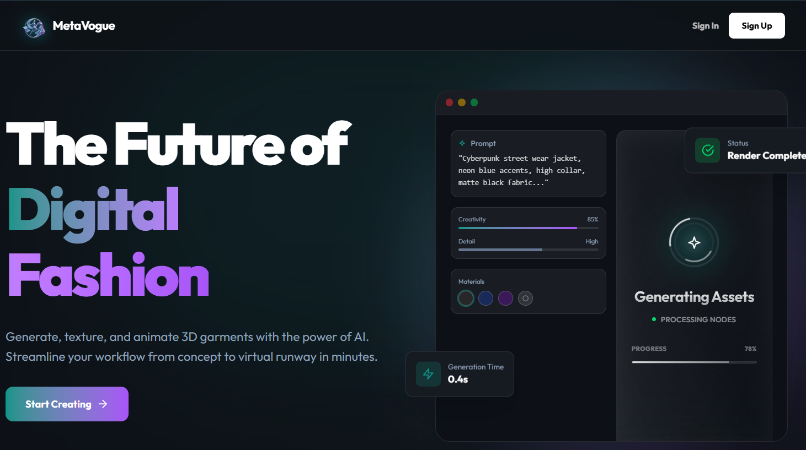

# 🌌 Web Meta: Virtual Wardrobe & Texture Studio



> **Digitize your physical garments and analyze human features for neural simulation.**
> Experience the future of fashion with AI-driven 3D model generation, texturing, and precise body feature extraction.

## ✨ Features

### 👕 Upload Studio & 3D Generation

Transform your physical clothing into digital assets.

- **Image to 3D**: Upload a photo of a garment and let AI build the geometry.
- **AI Processing**: Powered by **Meshy AI (v4)** for high-fidelity texture mapping.
- **Interactive Preview**: View your generated 3D model instantly in the browser using React Three Fiber.
- **Export Ready**: Download in **.GLB** or **.FBX** formats for use in Blender, Unity, or Unreal Engine.

### 🎨 Texture Studio

Apply AI-generated materials to any 3D model.

- **Text-to-Texture**: Describe a material (e.g., "worn leather", "holographic metal") and apply it to your model.
- **Model Support**: Upload your own `.glb` or use the generated assets.
- **Real-time Visualization**: See changes instantly with our PBR-enabled viewer.

### 🎥 Video Studio & Motion Generation

Create stunning runway animations and showcase videos from your generated fashion models.

- **Text-to-Video**: Powered by Replicate and the MiniMax Video-01 model.
- **AI Prompt Expansion**: Utilizes Gemini to automatically enhance user prompts for optimal motion and camera direction.
- **Subject Reference**: Ensures character consistency using subject reference images.

### 🧑‍🔬 AI Feature Extraction Studio

Advanced computer vision to analyze human portraits and full-body images.

- **Biometric Analysis**: Powered by MediaPipe and OpenCV to accurately extract body measurements, head poses, and body shapes.
- **Depth-Enhanced Estimation**: Utilizes HuggingFace Transformers (`Depth-Anything-V2`) to improve measurement depth projection.
- **Feature Recognition**: Automatically identifies hair type, eye color, emotions, and facial hair.

### 🤖 LLM & RAG Integration

- Natural language processing pipelines using **LangChain**, **Groq**, and **Google GenAI**.
- Built-in RAG capabilities for document processing and intelligent querying.

## ⚡ Core Tech Stack

| Component             | Technology                                             |
| --------------------- | ------------------------------------------------------ |
| **Frontend**    | React 19, Vite, TailwindCSS, PostCSS                   |
| **3D Engine**   | Three.js, React Three Fiber, Drei                      |
| **Backend API** | Node.js, Express.js                                    |
| **Database**    | MongoDB (via Docker Compose), Mongoose                 |
| **Python AI**   | Python 3.10, OpenCV, MediaPipe, PyTorch, Transformers  |
| **AI Services** | Meshy API, Replicate, ComfyUI, Gradio, LangChain, Groq |

## 🚀 Getting Started

### Prerequisites

- **Node.js** (v18 or higher)
- **npm** or **yarn**
- **Docker Desktop** (for MongoDB)
- **Miniconda/Anaconda** (for Python Feature Extractor environment)

### Installation

1. **Clone the repository**

   ```bash
   git clone https://github.com/yourusername/web-meta.git
   cd web-meta
   ```
2. **Start the Database**
   Start the local MongoDB instance using Docker:

   ```bash
   docker-compose up -d
   ```
3. **Automated Setup (Windows)**
   Run the provided setup script which installs Node dependencies and creates the Conda environment:

   ```bash
   setup.bat
   ```

   *Note: For Linux/macOS, use `bash setup.sh`*

### Manual Installation (If not using the setup script)

1. **Install Frontend and Backend Dependencies**

   ```bash
   npm install
   cd backend
   npm install
   cd ..
   ```
2. **Setup Python Environment**

   ```bash
   cd backend
   conda create -n feature-extractor python=3.10 -y
   conda activate feature-extractor
   pip install -r feature-extractor/requirements.txt
   cd ..
   ```

## ▶️ How to Run

You can launch both the frontend and backend automatically on Windows using the setup script, or manually:

### Frontend

Run from the **project root** — Vite serves the `frontend/` directory:

```bash
npm run dev
```

Open your browser and navigate to `http://localhost:5173`.

### Backend

The Express server runs on **port 3001** and communicates with the Python feature extraction scripts.

```bash
cd backend
npm run start
# OR using the batch script
start-server.bat
```

## 📦 Project Structure

```
web-meta/
│
├── 🎨 frontend/                    # React / Vite Application
│   ├── public/                     # Static assets served directly
│   ├── src/
│   │   ├── components/             # Reusable UI components
│   │   ├── context/                # Global state (GlobalContext.jsx)
│   │   ├── services/               # API integrations
│   │   ├── views/                  # UI Pages (Admin, Customer, Studios)
│   │   └── App.jsx                 # Main Application Router
│   └── index.html
│
├── ⚙️ backend/                     # Express Server + Python AI
│   ├── src/
│   │   ├── routes/                 # API Routes (meshy, replicate, extract, comfy)
│   │   ├── services/               # Services (ragService.js)
│   │   └── app.js                  # Express App configuration
│   ├── feature-extractor/          # Python AI feature extraction scripts
│   │   ├── feature-extraction.py   # Main MediaPipe/OpenCV script
│   │   └── requirements.txt        # Python dependencies
│   └── server.js                   # Entry point (Port 3001)
│
├── docker-compose.yml              # MongoDB container configuration
├── setup.bat / setup.sh            # Environment initialization scripts
├── vite.config.js                  # Vite config (root: ./frontend)
└── package.json                    # Monorepo dependencies
```

## 📄 License

Distributed under the MIT License. See `LICENSE` for more information.

---
